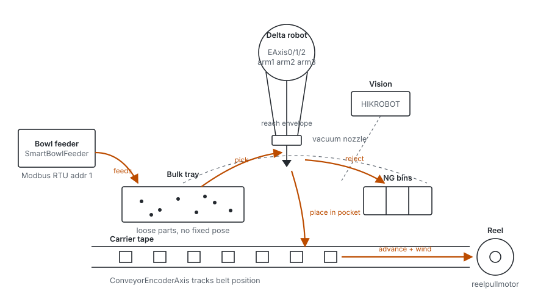

# The machine

What the hardware physically does, and which axis moves which mechanism.

[`architecture.md`](./architecture.md) is the *software* component map —
renderer, host, PLC, the events between them. This is the layer under
it: the metal. Read this first if you have never stood in front of the
machine, then read architecture.md to see what drives it.

For the bus-level configuration (device ids, DC settings, scaling,
IO mapping) see [`../3-subsystems/ethercat_config.md`](../3-subsystems/ethercat_config.md).

> **Provenance.** Layout and mechanism here were read off photographs of
> the rig plus the device tree in `PackerX.project`; names in `code font`
> are verified against the project or the PLC's own reports. Anything
> described in plain prose about the physical machine is an inference
> from the photos and worth correcting if wrong.

---

## What it does

It is a **taping machine** — hence `PackerX`. Small metal components
arrive loose, and leave seated one-per-pocket in sealed carrier tape on
a reel.

A bowl feeder vibrates parts onto a flat bulk tray where they land in
arbitrary positions. A delta robot picks them off that tray with a
vacuum nozzle, vision decides whether the part is good and how it is
oriented, and the robot places it into the next pocket of the carrier
tape running underneath. Bad parts go to NG bins instead. The tape
advances, cover tape seals the pockets, and the reel winds the finished
strip.



The same flow as text, for terminals and diffs:

```
  bowl feeder ──feeds──▶ bulk tray ──pick──▶ delta nozzle ──┬──▶ tape pocket ──▶ reel
  Modbus addr 1          loose parts         EAxis0/1/2     │    ConveyorEncoderAxis
                                                  ▲         │    reelpullmotor
                                                  │         └──▶ NG bins
                                             vision says
                                             good / bad / pose
```

---

## 作業流程（站點、打光、相機、單一物件 cycle）

2026-09-24 由使用者口述整理。

### 站點與打光（俯視）

```
┌────────────────────────┐
│  柔震盤                │  一號燈：柔震盤頂面，正面打光
│       [1]              │  相機甲：柔震盤頂部相機
└────────────────────────┘

  [3]        [2]           檢驗站
  側面打光   底面打光       相機乙：側面相機（配三號燈）
                           相機丙：仰視相機（配二號燈，打物料底面）

                   ┌──────────────┐
═══════════════════│══[4]═════════│══════ 載帶（由右往左捲）
◀── 載帶前進方向    │  槽位 0 1 2  │       載帶站
                   └──[5]─────────┘       相機丁：俯視高倍率相機
```

| 燈號 | 位置 | 用途 |
|---|---|---|
| 1 | 柔震盤頂面 | 正面打光，定位柔震盤上的料 |
| 2 | 檢驗站底面 | 打物料底面，給仰視相機 |
| 3 | 檢驗站側面 | 側面輪廓，給側面相機 |
| 4 | 載帶站側面 | 側光 |
| 5 | 載帶站正面 | 正光，觀察鏡面反射 |

所有燈的閃光和相機觸發都由 PLC 統一控制。

### 單一物件的流程

1. **柔震盤取料**：柔震盤定位後還有可抓的料，手臂就去取。
2. **檢驗站**（停止拍攝，手臂在每一拍都停下）
   1. 側面打光（三號燈）、側面拍照：判斷物件面向。這個面向從柔震盤俯視圖看不出來，要看側面；此時角度還不準，只用來分析面向。
   2. 底面打光（二號燈）、仰視拍照：檢查底面外觀，取得精確的偏移角度。
   3. 手臂繞 Z 軸旋轉補償角度（`G1` 的 `A` 座標，軸群組 `SpiderR`；實體軸推測是 `EAXIS_A`，**未確認**）。
   4. 再次側面打光、側面拍照：量測精確的輪廓尺寸。
   - **檢驗不良**：直接丟到不良品區，不放上載帶。不良品區有多個，依不良原因區分。
3. **載帶站放料**
   - 依照**上一輪**的載帶拍照結果，放到**編號最小、且不是良品**的槽位。
   - **先放後取**：放完新料之後，如果載帶上有不良品，再把它取走丟棄。
   - **無槽可放**（三槽都有物件）：先把手上的料丟回柔震盤，再去載帶上取走不良品。
4. **觸發載帶前進與拍照**：手臂放完料、Z 軸上升的時刻觸發
   - 載帶前進 N 格（規則見下）。
   - 雙光拍照：先打四號燈拍一張，再打五號燈拍一張，合併判斷每個槽位「有無物件」和「品質好壞」，給下一輪使用。
   - **拍照時機（容易出錯）**：
     - 有前進（N ≥ 1）：目前假設載帶前進完成時手臂已經離開視野，前進完就拍。
     - 不前進（N = 0）：必須等手臂離開相機視野才能拍。

### 載帶前進規則

槽位在載帶站框內，由左到右編號 0、1、2。**從 0 號開始數，連續良品有幾個就前進幾格**，前進後那幾格就離開載帶站。

| 上一輪檢驗結果 | 前進格數 |
|---|---|
| 0、1 都良品 | 2 格 |
| 只有 0 良品 | 1 格 |
| 只有 1 良品（0 不是） | 0 格，一定要從 0 連號 |

N **只依照上一輪的拍照檢驗結果**計算，不把這一輪剛放下的料算進去：剛放下的料還沒被檢驗過，不一定是良品，要等這次前進後的雙光拍照才知道。

### 待確認

- 不前進（N = 0）時，「手臂已離開視野」是怎麼判斷的：固定延遲、手臂位置，還是移動進度觸發？
- 有前進時「前進完成時手臂已離開」目前是假設。如果載帶只前進 1 格、手臂又移得慢，是否可能拍到手臂？
- Z 軸旋轉的實體軸（推測 `EAXIS_A`）需從 `SpiderR` 軸群組設定確認。

---

## Delta arm orientation

Three arms at 120°. `arm2` points along the carrier tape; `arm0` and
`arm1` trail behind it. The motors carry handwritten `AX0` / `AX2`
labels on the rig.

```
          arm1
            ╲
             ╲
              ╭──────╮
              │ base │────── arm2 ─────▶   direction of tape travel
              ╰──────╯
             ╱
            ╱
          arm0
```

The PLC reports these as `axes_labels = ["EAxis0 (arm1)", "EAxis1
(arm2)", "EAxis2 (arm3)", "reelpullmotor"]`. **Note the off-by-one
between the two namings**: the project's `EAxis0` carries the label
`arm1`. When someone says "arm 2", establish which of the two schemes
they mean before touching anything.

---

## Axis map

| Axis | DriveID | Moves | Notes |
|---|---|---|---|
| `EAxis0` | 3 | Delta arm | `bVirtual` pinned true in the device tree |
| `EAxis1` | 4 | Delta arm | `bVirtual` pinned true |
| `EAxis2` | 5 | Delta arm | `bVirtual` pinned true |
| `EAXIS_A` | 6 | QEC drive axis | not virtual |
| `SM_Drive_GenericDSP402` | 7 | QEC drive axis | `bVirtual` pinned true |
| `reelpullmotor` | 8 | Carrier tape advance / reel | modulo axis, period 200; direction inverted twice |
| `ConveyorEncoderAxis` | — | Belt position tracking (virtual) | feeds `Coord1CommitBind` |

The delta trio being virtual is the **tape-binding bench mode** added
2026-07-08: the reel motor runs for real while the arms are simulated,
so tape feeding can be commissioned without the robot moving. That is
why the PLC currently reports `axes_sim_mask = 7`.

---

## Control topology

```
  ┌──────────────┐   msgpack TCP        ┌────────────────────────────────┐
  │  Host PC     │──────────────────────▶│  SCIPC                         │
  │  Electron UI │   192.168.1.70:8125   │  Intewell + CODESYS runtime    │
  └──────────────┘                       │  target id 180A 0002           │
         │                               │                                │
         │ USB                           │  EtherCAT master   1 ms        │──▶ servos, IO
         ▼                               │    adapter I210_2              │
   HIKROBOT cameras                      │                                │
   VisionMaster                          │  Modbus RTU  COM3              │──▶ RS-485
                                         │    19200 8N1, addr 1           │    bowl feeder
                                         └────────────────────────────────┘
```

Two independent buses: **EtherCAT** for everything that has to be
deterministic (the servos, the digital IO coupler), and **Modbus RTU
over RS-485** for the feeder, which only needs setpoints and status.

---

## The feeder problem

A flexible feeder is to be added, and it speaks RS-485. Today it would
be driven from the PC over a USB-485 adapter, which splits control
across two machines:

```
  current                                proposed
  ───────                                ────────
  PC ──USB-485──▶ flexible feeder        PC ──TCP──▶ PLC ──RS-485──┬──▶ bowl feeder      addr 1
  PC ──TCP──────▶ PLC                                              └──▶ flexible feeder  addr 2
                   └──RS-485──▶ bowl feeder
```

The PC path works but leaves the feeder outside the PLC's timing and
state machine: the two have to be kept in step by the host, and
production depends on the PC being up. Putting both feeders on the
PLC's existing RS-485 bus at different `ServerAddress` values removes
that seam.

**Blocked on:** the PLC's RS-485 has never been made to work. Current
configuration and the candidate causes are in
[`../3-subsystems/ethercat_config.md`](../3-subsystems/ethercat_config.md#rs-485--modbus-rtu)
— in short, `ComPort = 3` may not map to the physical port, and the
slave's channel list may be empty. Dump the live configuration with:

```bash
python codesys_scripts/rpc.py exec --readonly \
    --file codesys_scripts/jobs/templates/dump_serial.py
```

---

## Peripherals not on either bus

| Thing | How it is driven |
|---|---|
| HIKROBOT cameras | USB/GigE to the PC, through VisionMaster |
| Samkoon HMI | its own panel, alongside the CODESYS application |
| Cover tape seal, tape guides | mechanical / pneumatic |

The vacuum nozzle and the pneumatics are switched through the EtherCAT
digital outputs — `AxisGroupSM.OutputCHs[0..6]` on the `EC0808DN`
coupler and its two terminal modules.
